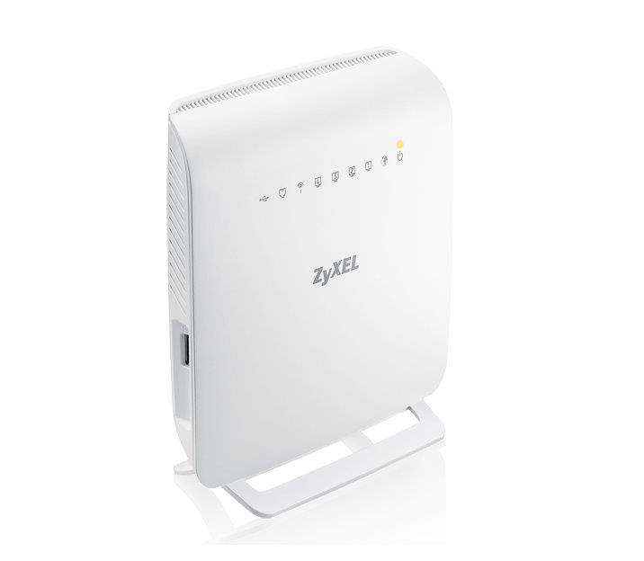
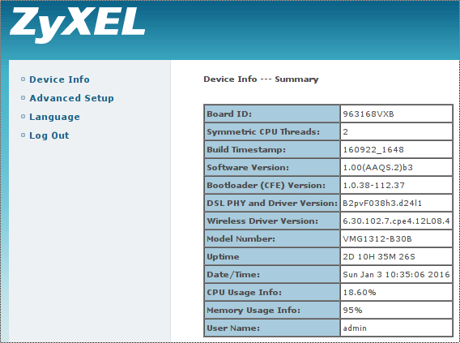
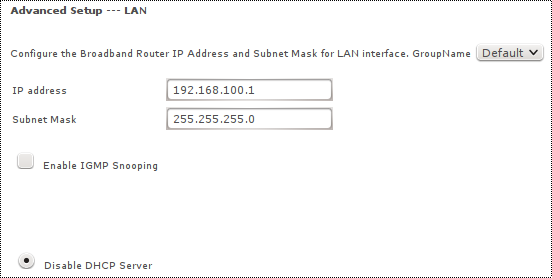
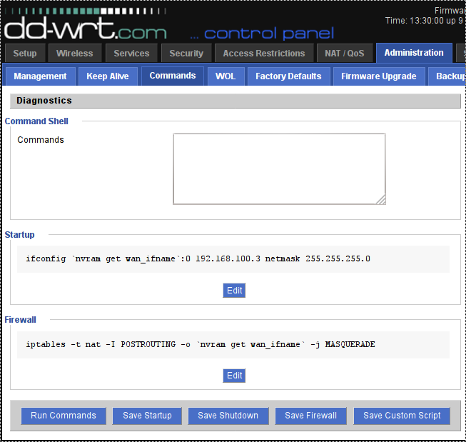
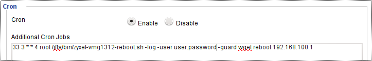

## Reboot ZyXEL VMG1312 from command line

Simple and effective command line script for rebooting the ZyXEL VMG1312.
It might work for other models too, however slight modification of grep patters might be required (depends on 
similarity of the web interfaces).

### ZyXEL VMG1312

ZyXEL VMG1312 is all-in-one SOHO solution (modem, router, WiFi AP) running internally on linux.
This device is just overloaded with features and when running as full router there are
some serious memory/cpu load problems and is very unstable. However, when used only in bridge mode,
ZyXEl VMG1312 is quite stable on ADSL/VDSL lines and it is very friendly price-wise (with the
exception of connection issue described in [iPTV](#iptv) section).

### Objective

This script is basically extension of the **DD-WRT** scheduled reboot capability. Now we can
schedule reboot also for xDSL modem. Reboot might be used as a workaround for various
firmware flaws and bugs. Of course user can manually switch off and on the router, but this
script can do it remotely and without user interaction if scheduled.

### iPTV

Router/modem ZyXEl VMG1312-B30B has some bug/flaw even in the latest firmware. After few weeks of uptime
the VMG1312 manifests slight delay when establishing a new connection. Might be caused by some unreleased
connection structures in memory so it takes longer and longer to allocate new connection structure with 
increasing uptime. Under normal usage like browsing it is somehow noticeable, however for iPTV even such 
a small delay is causing picture freezing for a few seconds as hls buffer underflows. And this iPTV video/audio 
freezing is very annoying and was the main motivation for this script to implement ...

So far there is no official solution from ZyXEL (and hardly it will ever be) so simple
workaround is just from time-to-time to reboot/restart/power-cycle the ZyXEL VMG1312 modem.

Here are a few candidates with possibility to cause this issue:

* PPPoE Session-ID caching bug in Bridge mode - [https://www.spinics.net/lists/linux-ppp/msg01735.html](mailing list)
* List of known VMG1312 bugs - [https://support.aa.net.uk/VMG1312-B10A:_Bugs](AA support.aa.net.uk)

### How does it work

The script uses standard DD-WRT **wget**, **awk** and **grep** utilities to access ZyXEL VMG1312 web interface and 
extracting useful data from html pages.

The execution flow is quite simple:
* login to the info page
* get session-key (required for requesting reboot)
* request reboot (with valid session-key)

ZyXEL VMG1312 Device Info Page contains various uptime and cpu/memory load info.

ZyXEL VMG1312 Reboot Page for manual reboot by clicking the button.

### Requirements

This script requires:
* basic unix utilities (included in dd-wrt):
  * wget, awk, grep, sed
* access to modem web interface - this requires some additional [config on VMG1312 and DD-WRT](#modem-in-bridge-mode---access-to-web-interface) 
when modem is in the bridge mode

### Install

To install on DD-WRT follow the steps:
* copy the script to the suitable location (for example /jffs/bin), other suitable locations are (from default PATH):
  * /jffs/sbin:/jffs/bin:/jffs/usr/sbin:/jffs/usr/bin
  * /mmc/sbin:/mmc/bin:/mmc/usr/sbin:/mmc/usr/bin
  * /opt/sbin:/opt/bin:/opt/usr/sbin:/opt/usr/bin
* set executable flag if not set
* optional - test execution from command line
* optional - setup the cron job (from command line or [web interface](#cron-scheduler))

## Usage

Script can be used manually from command line or scheduled by cron job. There are two modalities
currently implemented:
* *uptime* modality - just shows various uptime and load values (no reboot is executed)

    
    $ zyxel-vmg1312-reboot.sh -user login:password uptime vdsl_modem
    WARNING - Modem mdm login attempt 1 from 3 failed, keep trying ...
    Modem mdm has Uptime 6d7h26m38s, DSL Uptime: 6d7h25m29s, PPP Uptime: 0d0h0m0s, CPU:5.50% MEM:93%
    
    Output explained:
    * the first failed login attempt as WARNING - Modem mdm login attempt 1 from 3 failed, keep trying ...
    * modem uptime 6d_7h_26m_38s (6 days, 7 hours, 26 minutes, 38 seconds)
    * xDSL  uptime 6d_7h_25m_29s (6 days, 7 hours, 26 minutes, 29 seconds) implies xDSL login took 9 seconds
    * PPP   uptime 0d_0h__0m__0s due to VMG1312 bridge-mode (PPP is handled by DD-WRT in PPPoE settings)
    * CPU load (utilization) 5.5%
    * Memory load (utilization) 93%
    
* *reboot* modality - shows various uptime and load values and executes reboot

There are many optional parametes (see bellow) and few mandatory ones:

    usage: zyxel-vmg1312-reboot.sh [-log|-log-tag tag] [-try limit] [-guard cmd] -user user:pass (uptime|reboot) target

    -log            ... (optional) log script output to syslog instead to stdout (usefull when executing from cron)
    -log-tag tag    ... (optional) log to syslog (see -log above) with specific tag (default tag is VDSL)
    -try limit      ... (optional) limit login tries to limit (default 3)
    -guard cmd      ... (optional) do not reboot target if cmd is running (download ia wget/curl etc)
    -user user:pass ... valid login for target device separated by :
    uptime          ... only show target uptime/load, do not reboot (usefull for checking if target was recently rebooted)
    reboot          ... perform reboot (see -gurad parameter above)
    target          ... target device to reboot (hostname or ip address)

All outputs go to STDOUT by default (useful for debugging). Use -log or -log-tag parameter to redirect output to 
syslog (useful for cron jobs).

Shell exitcodes:

    0 ... ok (uptime shown / reboot requested)
    1 ... usage help
    2 ... login failed (tries limit reached)
    3 ... guarding process active/running, reboot not executed
    4 ... parameters validation failed (invalid action, malformatted login:password)

### Modem in bridge mode - access to web interface

Access to web interface to modem in bridge mode is very useful for statistical and management purposes.

    Modem VMG1312
    
We have to assign some private subnet for LAN interface on modem site, for example 192.168.100.1/24:

    DD-WRT Router
    
Then on the router / DD-WRT site we have to add another address from this subnet to WAN interface
and also add postrouting iptables rule (for example 192.168.100.3/24):

_NOTE: The private subnet 192.168.100.X and ip addresses 192.168.100.1, 192.168.100.3 are just an example of my current config.
You can choose different subnets and different ip addresses without any problems_

### Cron scheduler

Cron functionality is built-in in DD-WRT. There is even web interface to edit cron jobs:

The screenshot shows the scheduled cron job to reboot router every Wednesday at 03:33 AM by executing this command as root
(output to syslog, check for running instances of wget and skip reboot if running for target 192.168.100.1):

    /jffs/bin/zyxel-vmg1312-reboot.sh -log -user user:password -guard wget reboot 192.168.100.1

More details about cron functionality on DD-WRT [wiki](https://wiki.dd-wrt.com/wiki/index.php/CRON)

## Possible future improvements

* detect when connection issue is present:
The more sophisticated way would be to detect connection establishment delay by some script
and reboot VMG1312 modem only when neccessary (if connection delay to some reference host is over the limit). 
In my experience this modem runs well for a few weeks (3-5) until the problem manifests. So periodic rebooting 
weekly should solve the issue and there is always a possibility to increase the frequency of rebooting (daily).

* implement fix/workaround directly on VMG1312 modem:
The VMG1312 runs on linux so there should be a way to better diagnose the problem and try to implement
a fix or workaround directly on the VMG1312. Then there would be no need for scheduled rebooting. Unfortunately
ZyXEL does not provide source code of the VMG1312 firmware.

_keywords: zyxel, vmg1312, vdsl, adsl, modem, bridge, dd-wrt_
