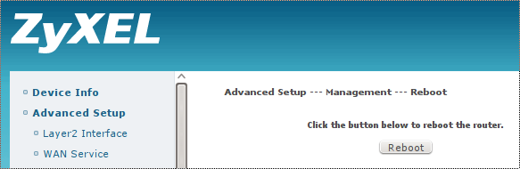

## Reboot ZyXEL VMG1312 from command line

Simple and effective command line script for rebooting the ZyXEL VMG1312.
It might work for other models, however slight modification of grep patters might be required (depends on similarity of
the web interfaces).

### ZyXEL VMG1312

ZyXEL VMG1312 is all-in-one SOHO solution (modem, router, WiFi AP) running internally linux.
This device is just overloaded with features and when running as full router there are
some serious memory/cpu load problems and is very unstable. However, when used in bridge mode,
ZyXEl VMG1312 is very stable on ADSL/VDSL lines (with following connection establishment issue).

### objective

This script is basically extension of the **DD-WRT** scheduled reboot capability. Now we can
schedule reboot also for xDSL modem. Reboot might be used as a workaround for various
firmware flaws and bugs. Of course user can manually switch off and on the router, but this
script can do it remotely and without user interaction if scheduled.

### iPTV

Router/modem ZyXEl VMG1312-B30B has some bug/flaw even in the latest firmware. After few weeks of uptime
the VMG1312 brings slight delay when establishing a connection. Might be caused by some unreeased
connection structures in memory so it takes longer and longer to allocate new connection structure.
Under normal usage like browsing it is somehow noticeable, however for iPTV even such a small delay is
causing picture freezing for a few seconds as hls buffer underflows. And this iPTV video/audio freezing
is very annoying and was the main motivation for this script to implement ...

So far there is no official solution from ZyXEL (and hardly it will ever be) so simple
workaround is just from time-to-time to reboot/restart/power-cycle the ZyXEL modem.

### How does it work

The script uses standard DD-WRT **wget**, **awk** and **grep** utilities to access ZyXEL VMG1312 web interface.
The execution flow is quite simple:
* login to info page
* get session-key (required for requesting reboot)
* request reboot (with session-key)

ZyXEL VMG1312 Device Info Page contains various uptime and cpu/memory load info.

ZyXEL VMG1312 Reboot Page for manual reboot by clicking the button.

### requirements

This script requires:
* unix utilities (included in dd-wrt):
  * wget, awk, grep, sed
* access to modem web interface - this requires some [config on VMG1312 and DD-WRT][#Modem in bridge mode - access to web interface] when modem is in bridge mode

## usage

Script can be used manually from command line or scheduled by cron job. There are two modalities
currently implemented:
* *uptime* modality just shows various uptime and load values (no reboot is executed)
* *reboot* modality shows various uptime and load values and executes reboot

There are many optional parametes (see bellow) and few mandatory ones:

    '''
    usage: zyxel-vmg1312-reboot.sh [-log|-log-tag tag] [-try limit] [-guard cmd] -user user:pass (uptime|reboot) target

    -log            ... (optional) log script output to syslog instead to stdout (usefull when executing from cron)
    -log-tag tag    ... (optional) log to syslog (see -log above) with specific tag (default tag is VDSL)
    -try limit      ... (optional) limit login tries to limit (default 3)
    -guard cmd      ... (optional) do not reboot target if cmd is running (download ia wget/curl etc)
    -user user:pass ... valid login for target device separated by :
    uptime          ... only show target uptime, do not reboot (usefull for checking if target was recently rebooted)
    reboot          ... perform reboot (see -gurad parameter above)
    target          ... target device to reboot (hostname or ip address)
    '''

All outputs go to STDOUT by default (useful for debugging).
By using -log parameter they are redirected to syslog (useful for cron jobs).

### Modem in bridge mode - access to web interface

Access to web interface to modem in bridge mode is very useful for statistical and management purposes.

We have to assign some private subnet for LAN interface on modem site, for example 192.168.100.1/24:

Then on router / DD-WRT site we have to add another address from this subnet to WAN interface
and also add postrouting iptables rule (for example 192.168.100.3/24):

_NOTE: The private subnet 192.168.100.X and ip addresses 192.168.100.1, 192.168.100.3 are just example what I'm using.
You can choose different subnets and different ip addresses_

### Scheduling by cron

Cron functionality is built-in in DD-WRT. There is even web interface to edit cron jobs:

The screenshots shows scheduled cron job to reboot router every Thursay at 03:33 AM by executing this command as root:

    '''
    /jffs/bin/zyxel-vmg1312-reboot.sh -log -user user:password -guard wget reboot 192.168.100.1
    '''

More details about cron functionality on DD-WRT [wiki](https://wiki.dd-wrt.com/wiki/index.php/CRON)

## possible future improvements

* detect when issue is present:
The more sophisticated way would be to detect connection establishment delay by some script
and reboot VMG1312 modem only when neccessary (if delay is over limit). In my experience this modem runs well for
a few weeks (3-5) until the problem manifests. So periodic rebooting weekly should solve the issue. There is
always a possibility of increase the frequency of rebooting up to daily.

* implement fix/workaround directly on VMG1312 modem:
The VMG1312 runs linux so there should be a way to better diagnose the problem and try to implement
a fix or workaround directly on the VMG1312. Then there would be no need for scheduled rebooting.

### keywords: zyxel, vmg1312, vdsl, adsl, modem, bridge, dd-wrt
